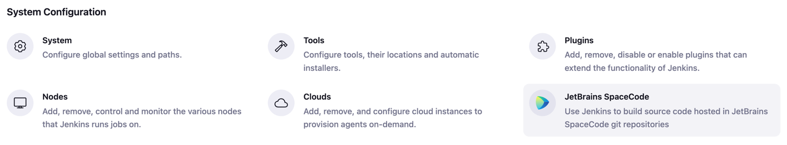
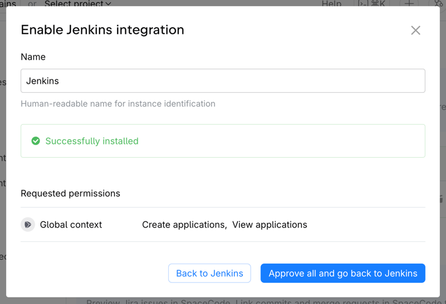
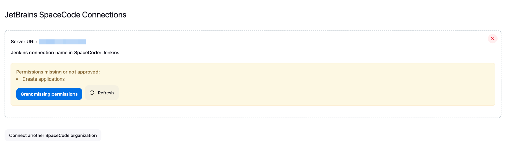
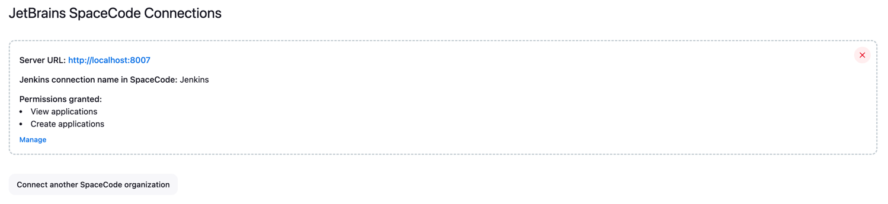
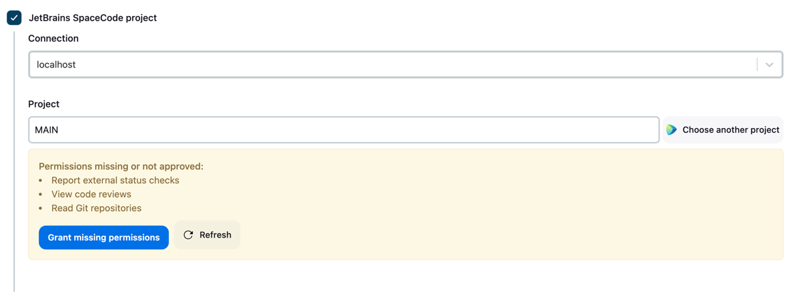
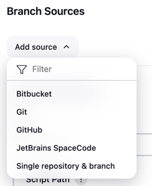
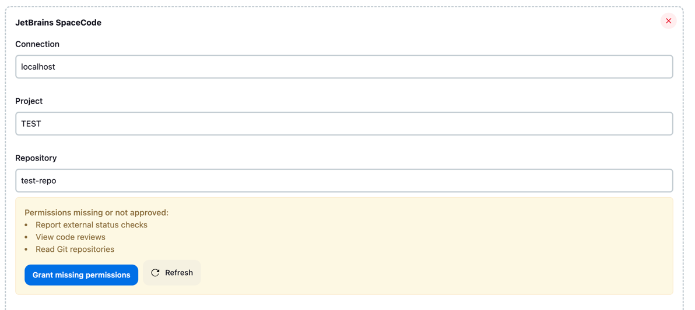

# JetBrains SpaceCode plugin for Jenkins

[](https://confluence.jetbrains.com/display/ALL/JetBrains+on+GitHub)

## About

This Jenkins plugin provides integration with JetBrains SpaceCode and enables the following use cases:
* Triggering jobs in Jenkins on new commits or merge request updates in JetBrains SpaceCode;
* Reporting a build status to JetBrains SpaceCode (can be used in [Quality Gates for Merge Requests](https://www.jetbrains.com/help/space-code/branch-and-merge-restrictions.html#quality-gates-for-merge-requests));
* Using Jenkins jobs for [safe merging](https://www.jetbrains.com/help/space-code/branch-and-merge-restrictions.html#safe-merge) changes to the main branch in JetBrains SpaceCode;
* Posting messages to the merge request timeline in JetBrains SpaceCode on behalf of Jenkins integration;
* Hyperlinks to branches, files and diffs in JetBrains SpaceCode on the Changes page of a Jenkins build.

Please use GitHub Issues to report problems or suggest enhancements.

## Requirements

* Jenkins version 2.440.3+
* Cloud JetBrains SpaceCode organization

## License

Licensed under MIT, see [LICENSE](LICENSE.md)

## Contributing

Refer to our [contribution guidelines](CONTRIBUTING.md)

## Table of Contents
- [Connect Jenkins instance to JetBrains SpaceCode organization](#connect-jenkins-instance-to-jetbrains-spacecode-organization)
- [Connect Jenkins job or pipeline to JetBrains SpaceCode project](#connect-jenkins-job-or-pipeline-to-jetbrains-spacecode-project)
- [Triggering Builds](#triggering-builds)
- [Using Jenkins builds for safe merge](#using-jenkins-builds-for-safe-merge)
- [Checking out source code from SpaceCode](#checking-out-source-code-from-spacecode)
- [Hyperlinks to SpaceCode for build changes](#hyperlinks-to-space-for-build-changes)
- [Posting build status to SpaceCode](#posting-build-status-to-space)
- [Posting a message to the merge request timeline in SpaceCode](#posting-a-message-to-the-merge-request-timeline-in-space)
- [Calling SpaceCode HTTP API from pipeline script](#calling-spacecode-http-api-from-pipeline-script)
- [Environment variables](#environment-variables)
- [Multibranch pipelines](#multibranch-pipelines)

## Connect Jenkins instance to JetBrains SpaceCode organization

First make sure that you have the Jenkins URL configured in Jenkins itself - navigate to **Jenkins > Manage Jenkins > System**, then find and fill in the **Jenkins URL** field.

After installing the plugin, start with connecting your Jenkins instance to the JetBrains SpaceCode organization.
Navigate to **Jenkins > Manage Jenkins > JetBrains SpaceCode** or to the `/manage/spacecode/` page on Jenkins to configure connections to SpaceCode:


Click on the **Connect** button to connect JetBrains SpaceCode organization. You will be presented with the organization selection dialog.
If you aren't logged in to SpaceCode, you will be first asked to log in. Once you are logged in, you can choose the JetBrains SpaceCode organization
to connect to. If you don't see one in the list, you can also directly enter its URL in the field below - this is the case with on-premise JetBrains SpaceCode installations.
The next step will be to confirm Jenkins integration installation to the SpaceCode organization in the same dialog browser window and then approve the permissions required for it:



If the installation was successful and all the required permissions have been approved, the **JetBrains SpaceCode Connections** page in Jenkins
will refresh and display the newly established connection with the list of JetBrains SpaceCode permissions granted to it 
together with the **Manage** link that leads to the integration management page in JetBrains SpaceCode.

If the required permissions have not been approved on the JetBrains SpaceCode side, the **JetBrains SpaceCode Connections** page in Jenkins
will show a warning about it, suggesting to navigate to SpaceCode and approve the required permissions:


Navigate to JetBrains SpaceCode using the **Grant missing permissions** button and approve the requested permissions,
or ask your SpaceCode administrator do to it if you don't have enough rights. Permissions have to be approved before moving on to the next steps.



### Connect Jenkins job or pipeline to JetBrains SpaceCode project

To connect a Jenkins job or pipeline to the JetBrains SpaceCode repository, you need to enable the **JetBrains SpaceCode project** checkbox 
in the **General** section of the job configuration page, pick the SpaceCode connection from the dropdown list and then choose a SpaceCode project.
You'll be asked to log into JetBrains SpaceCode (if you are not logged in) and grant permissions for the integration to fetch projects from JetBrains SpaceCode on your behalf.
You can therefore only connect Jenkins job or pipeline to a SpaceCode project that you have view permissions for yourself.
After choosing the SpaceCode project, confirm establishing the connection by pressing the **Connect** button.
A separate project-level connection with the new set of credentials (client id and secret for API calls as well as SSH key for interacting with Git) will be set up behind the scenes.

This separate project-level connection will request several permissions in JetBrains SpaceCode, which need to be approved on the SpaceCode side.
You will see a warning on the Jenkins job configuration page until these permissions are approved:


Navigate to JetBrains SpaceCode using the **Grant missing permissions** button and approve the requested permissions,
or ask your SpaceCode project administrator to do it if you don't have administator rights in this project.
SpaceCode project should be connected, and permissions for it have to be approved before moving on with configuring a build trigger or SCM settings for the Jenkins job or pipeline.

If you want to change the JetBrains SpaceCode project that the Jenkins job/pipeline is connected to, you can do it
by pressing the **Choose another project** button. You'll need to sign in to JetBrains SpaceCode to view the projects list and
approve the permissions for a newly selected project.

### Managing Jenkins connections in JetBrains SpaceCode

Although the connection setup process takes place entirely in Jenkins, JetBrains SpaceCode administrative UI also has a page that allows you
to overview and to some extent manage connections to Jenkins. To access this page, click your profile icon in the top right corner, 
select the **Administration** option from the dropdown menu and then navigate to the **Featured integrations** page via the left sidebar.
Alternatively, you can go directly to the `/manage/integrations` URL in JetBrains SpaceCode. 

On this page you can have an overview of all available and configured connections with some of the most popular CI/CD and issue tracking tools, Jenkins included.
The **Manage** button for a Jenkins connection takes you to the overview page of the corresponding Jenkins instance, where you can view and update 
the connection name (used for identifying the connection in safe merge configuration files), Jenkins instance URL and the list of SpaceCode projects
linked to Jenkins jobs or pipelines. Each Jenkins job or pipeline has its own dedicated project-level connection, so you might see more than one entry
for the same SpaceCode project in the **Projects** section. The list of displayed SpaceCode projects used in Jenkins might also be incomplete
if you don't have viewing permissions for some of such projects.

You can configure, approve or revoke access rights on the SpaceCode side for each project-job connection, provided that you have administrative rights for the given SpaceCode project.
The set of permissions might need to be adjusted if you plan to invoke SpaceCode API methods from your Jenkins pipeline scripts as described in [Calling SpaceCode HTTP API from pipeline script](#calling-space-code-http-api-from-pipeline-script).
This page also allows you to delete the connection for a given pair of a SpaceCode project and Jenkins job/pipeline, as well as the connection between your SpaceCode organization and Jenkins instance.

### Triggering builds

The plugin provides an option to trigger builds whenever new commits are pushed to a git repository or some changes are made to a merge request in SpaceCode.
This trigger is enabled by the **Triggered by JetBrains SpaceCode** checkbox in the **Build Triggers** section of the job or pipeline configuration page.
For this trigger, you need to specify the git repository that belongs to the JetBrains SpaceCode project connected to this job or pipeline.

If you choose to trigger a build by new commits pushed to the repository, you can also specify which branches should trigger a build and which should not.
The text field **Branches** under the **Trigger on commits** option accepts a list of branch specs separated by a semicolon.
Each branch spec can contain a branch name or  `*` wildcard and should start with either `+` (include branches)  or `-` (exclude branches) symbol, excludes take precedence over includes.

If a build is configured to be triggered by merge request changes, there are three event filters available:
* When the **Build only after merge request is approved by all reviewers** checkbox is checked, builds will only be triggered for merge requests approved by all the invited reviewers.
  There should be at least one reviewer in a merge request to trigger a build.
  A build will be triggered when new commits are added to a merge request (provided that all reviewers' approvals are finalized and not reset by these commits) 
  or when the last reviewer approves the merge request;
* **Branch specs** filter has the same format as the one for triggering by commits, and is applied to the source branch of a merge request;
* **Title filter regex** allows triggering builds only for merge requests with a title matching specified regular expression.
  A build will be triggered when a merge request with the title matching the regex is created, when new commits are added to it, or when a non-matching merge request title is changed so that it now matches the regex.
  Regular expression must match the entire merge request title, not just a part of it. For example, to exclude all merge requests with the title starting with "WIP" from triggering builds, specify `(?!WIP).+` as a regex.

You might occasionally want to trigger a Jenkins build by specifying a branch name or merge request number manually, instead of relying on the trigger.
This is possible:
* Make your Jenkins project parameterized (go to **Configuration** page and check the **This project is parameterised** checkbox);
* Add the **GIT_BRANCH** (if your Jenkins job is set up for triggering on branch updates) or **SPACE_MERGE_REQUEST_NUMBER** (if it is used for safe merges or triggered on merge request updates) string parameter;
* Run the build manually. Specify either the git branch name or SpaceCode merge request number.

The build will run as if it has been triggered by the change in the corresponding branch or merge request.

### Using Jenkins builds for safe merge

Safe merge is a JetBrains SpaceCode feature that lets you execute quality checks for the merge request on the merge commit before changes are actually merged into the target branch.
It checks a temporary merge commit it creates and allows you to merge only if the checks are successful.
See [SpaceCode documentation](https://www.jetbrains.com/help/space-code/branch-and-merge-restrictions.html#safe-merge) on safe merge for more information.

You can use builds in Jenkins to perform quality checks for safe merge. On the Jenkins side, you need to enable **Triggered by JetBrains SpaceCode** for a build,
specify the git repository and enable safe merge. Safe merge can be enabled in the trigger settings in one of the three ways:
* if the build will be used only for safe merges, choose **Use only for safe merge**;
* if the build will be used for safe merges as well as automatically triggered by pushes to specific git branches, choose **Trigger on commits** and then check **Also allow safe merge**;
* if the build will be used for safe merges as well as automatically triggered by changes to specific merge requests, choose **Trigger on merge requests changes** and then check **Also allow safe merge**.

On SpaceCode side, safe merge should be configured in `safe-merge.json` file that is stored in the git repository. Here is an example of the safe merge configuration for Jenkins:
```json
{
    "version": "1.0",
    "builds": [
        {
            "jenkins": {
                // name of the Jenkins connection configured in SpaceCode 
                "connection": "Jenkins",
                // full name of the Jenkins job or workflow, including all the parent folders if any
                "project": "Folder/NestedJob"
            }
        }
    ]
}
```

In the Jenkins pipeline script, the only thing you'll need to have is the `checkout SpaceGit()` step to check out source code from Git.
The temporary branch with the merge commit created by SpaceCode will be checked out from the repository specified in the build trigger settings.
Build status will also be automatically reported to SpaceCode upon build completion.

### Checking out source code from SpaceCode

The recommended way to check out sources to build from a Git repository hosted in JetBrains SpaceCode is by using the SCM (Source Control Management) source provided by the plugin.

For Jenkins jobs, it is available under the **JetBrains SpaceCode** radio button in the **Source Code Management** section of the job configuration page.
There are two options for checking out code from SpaceCode by using this SCM:
* **Post build status to SpaceCode** checkbox determines whether a build status will be automatically reported to SpaceCode
  to be displayed as an external check for the commit (which can be further used for the [Merge request quality gates](https://www.jetbrains.com/help/space-code/branch-and-merge-restrictions.html#quality-gates-for-merge-requests) or [Safe merge](https://www.jetbrains.com/help/space-code/branch-and-merge-restrictions.html#safe-merge) functionality in SpaceCode).
  When this checkbox is selected, Jenkins will report the status for the Git commit currently being built to SpaceCode twice - first as `running`, when the build starts, and then as `succeeded`, `failed` or `terminated` depending on the build outcome when it finishes.
* **Specify SpaceCode repository** optional section allows overriding the Git repository that the source code is checked out from.
  By default, the repository is taken from the build trigger settings. If the build isn't triggered by the JetBrains SpaceCode trigger, then the repository must be specified in the source checkout settings, 
  otherwise the build will fail at runtime. When specifying the repository explicitly, you can also specify the branches refspec 
  that controls the remote refs to be retrieved and how they map to local refs. The branch that triggered the build is always retrieved from git repository as well,
  there is no need to specify a refspec for it. 


For Jenkins pipelines, you can invoke it with the standard `checkout` pipeline step by passing a parameterized instance of `SpaceGit` object to it:
```groovy
checkout SpaceGit()
checkout SpaceGit(postBuildStatusToSpace: false)
checkout SpaceGit(repository: 'prj-main-repo', branches: [[name: 'refs/heads/feature-*']])
```

All the parameters in the scripted form described above are optional. However, *branches* can only be specified together with the *repository* parameter.
You can use the Jenkins pipeline syntax generator to pick the **checkout** step, choose the **JetBrains SpaceCode** source, configure all the parameters in the UI
and then generate a script for calling this step with the parameters configured.

There is also an option to check out sources from SpaceCode git repository by using a standard Git SCM and providing the git repo clone URL and SSH key or HTTP password in place: 
```groovy
checkout scmGit(branches: [[name: '*/master']], extensions: [], userRemoteConfigs: [[credentialsId: 'ssh-creds-for-space', url: 'ssh://git@git.jetbrains.space/my/proj/proj-repo.git']])
```

This approach requires you to copy the repository URL from the **Start coding** dialog in SpaceCode interface, as well as providing the public and private SSH keys on the JetBrains SpaceCode and Jenkins sides respectively.
You will also lose some of the SpaceCode-specific environment variables in this case. Therefore using the standard `scmGit` source instead of the plugin-provided `SpaceGit` is only recommended
if you need some additional checkout behaviours that are impossible to configure with the `SpaceGit` checkout action.

### Hyperlinks to SpaceCode for build changes

When a Jenkins job or pipeline fetches source code from a SpaceCode repository using SpaceCode SCM as described in the section above,
the plugin will enrich the commits and changes info on the **Changes** page of a job or pipeline by adding links to JetBrains SpaceCode for commits, files and file diffs.
This allows you to easily navigate from Jenkins job to JetBrains SpaceCode to view the commits being built, files that they modify and change diffs for these files.

If you are checking out source code by using standard Git SCM instead of SpaceCode SCM, you can also enable links to SpaceCode for the **Changes** page of your builds.
Choose the **JetBrains SpaceCode** option for the **Repository browser** field of the Git SCM and specify the base repository URL in the form of `https://<your SpaceCode instance>/p/<project key>/repositories/<repository name>`


The scripted form for such pipeline checkout step will have the `browser` parameter with `jbSpace` specified as its value:

```groovy
checkout scmGit(browser: jbSpace('http://my.jetbrains.space/p/prj/repositories/main-repo'), /* branches, userRemoteConfigs etc... */)
```

### Posting build status to SpaceCode

A job or pipeline in Jenkins will automatically post a build status for the commit to SpaceCode if source code has been checked out with the [SpaceCode SCM](#checking-out-source-code-from-spacecode) source.
The build will be reported as running upon source code checkout, and completed, failed or terminated, depending on the build outcome upon its completion.
Automatic build status posting is enough for most cases, but the plugin also defines a pipeline step for more granular control
over when and what status is posted to SpaceCode - the **postBuildStatusToSpace** pipeline step:

```groovy
postBuildStatusToSpace buildStatus: 'SUCCEEDED'
```

As usual, you can explore the parameters available and generate the script snippet on the **Pipeline syntax** page in Jenkins.
The only required parameter is **Build status to report** (or *buildStatus* in the script representation).
There is also an optional section that allows overriding the Git repository, commit and branch name that the build status is reported for.
When the Git repository, commit and branch name aren't specified explicitly, they are taken either (in priority order) from the build trigger settings (if JetBrains SpaceCode trigger is enabled for this job or pipeline)
or from the source code checkout settings (this can be either SpaceCode SCM or Git SCM).

Once a build status is reported to SpaceCode by invoking the **postBuildStatusToSpace** pipeline step, it won't be automatically reported again
when the build finishes, to prevent overwriting the status reported by the step. Thus, you can use a number of **postBuildStatusToSpace** in your pipeline script
to report build failures for some cases and at the same time rely on the automatic build status posting to report the final outcome
when none of those cases have happened and thus no post build status steps have been called. 

### Posting a message to the merge request timeline in SpaceCode

Another pipeline step provided by the plugin allows posting a message to the merge request timeline in SpaceCode on behalf of Jenkins integration.

```groovy
postReviewTimelineMessageToSpace 'Here are some details about how the build is going...'
```

You can use [markdown syntax](https://www.jetbrains.com/help/space-code/markdown-syntax.html) to add formatting to the message.
If your job or pipeline uses JetBrains SpaceCode trigger listening to merge request updates, then the message text is the only parameter required for the pipeline step.
Otherwise, you will also need to provide the **mergeRequestNumber** parameter. The number of a merge request is part of its URL - `/p/<project key>/reviews/<number>/timeline`.

### Calling SpaceCode HTTP API from pipeline script

SpaceCode provides an extensive HTTP API to fetch or manipulate its data, described in detail at https://www.jetbrains.com/help/space-code/api.html.
SpaceCode plugin for Jenkins provides a pipeline step to easily perform calls to this API on behalf of Jenkins integration.
You pick one of the preconfigured SpaceCode connections, specify HTTP method, path and request body, and the step takes care of proper authentication
and deserialization of a JSON response. The step returns parsed JSON response in the form of [JsonNode](https://fasterxml.github.io/jackson-databind/javadoc/2.8/com/fasterxml/jackson/databind/JsonNode.html) instance from the Jackson library.
You can then access various properties of the resulting JSON by using indexing into its properties.

```groovy
script {
    def result = callSpaceApi(httpMethod: 'GET', requestUrl: '/api/http/applications/me')
    echo result["name"].asText()
    echo result["createdAt"]["iso"].asText()
}
```

**NOTE:** Make sure you grant Jenkins integration the permissions required to access all the API endpoints you intend to call from your pipeline scripts.

### Environment variables

SpaceCode plugin provides a number of environment variables that can be used by the pipeline logic:
* `SPACE_CODE_URL` - base URL of your SpaceCode organization;
* `SPACE_CODE_PROJECT_KEY` - SpaceCode project key;
* `SPACE_CODE_REPOSITORY_NAME` - Git repository name

These three env variables are provided by the JetBrains SpaceCode trigger or by the source code checkout step (code checkout settings take precedence over build trigger in case both have an explicitly specified SpaceCode connection).

When a build is triggered by a SpaceCode merge request, those variables are also provided:
* `MERGE_REQUEST_ID` - merge request identifier, can be used to query more details about the merge request from the SpaceCode HTTP API; 
* `MERGE_REQUEST_NUMBER` - merge request number;
* `MERGE_REQUEST_SOURCE_BRANCH` - name of the merge request source branch;
* `MERGE_REQUEST_TARGET_BRANCH` - name of the merge request target branch;
* `MERGE_REQUEST_TITLE`- merge request title;
* `MERGE_REQUEST_URL` - URL of the merge request page in SpaceCode; 
* `IS_SAFE_MERGE`- true if build has been triggered by a safe merge, absent otherwise;
* `IS_DRY_RUN` - true if safe merge is being executed in the dry run mode (that is, SpaceCode won't merge the changes into the target branch even if checks are successful);
* `SAFE_MERGE_STARTED_BY_USER_ID` - id of SpaceCode user that has started the safe merge; absent if build is not triggered by safe merge.

All the environment variables provided by the standard Git plugin (https://plugins.jenkins.io/git/#plugin-content-environment-variables) are also available when checking out source code using SpaceCode SCM.

### Multibranch pipelines

[Jenkins multibranch projects](https://www.jenkins.io/doc/book/pipeline/multibranch/) rely on **Branch Sources** to connect to the source code. JetBrains SpaceCode plugin provides Jenkins with the Branch Source, which allows Jenkins to discover branches and pull requests from SpaceCode. 
For each discovered branch or pull request that match the filters, Jenkins multibranch project will create a child Jenkins job. Such jobs typically use `Jenkinsfile` files from the corresponding branch for their pipeline definition.

You need to have the [workflow-multibranch] Jenkins plugin installed to use the multibranch pipelines feature in Jenkins.

Start with creating a new Jenkins item of the **Multibranch pipeline** type and add the **JetBrains SpaceCode** Branch Source to the list of its Branch Sources:



In the Branch Source configuration, select the SpaceCode organization from which you want to fetch branches or merge requests. Next, you'll be prompted to sign in to SpaceCode to view the available projects. After signing in, you will be asked for a permission to read your SpaceCode projects and repositories on your behalf.
You can therefore only connect the Branch Source to a SpaceCode project that you have view permissions for. Choose the desired project and repository, then initiate the connection by pressing the **Connect project to JetBrains SpaceCode** button. This action will establish the connection and create the project-level integration on the SpaceCode side.
The integration will then request the permissions required on the SpaceCode side for it to function properly. Until all necessary permissions are approved, the Branch Source configuration page will display a warning.



The **Grant missing permissions** button will take you to JetBrains SpaceCode where you can approve the requested permissions. if you don't have enough rights, ask your SpaceCode administrator to approve them for you.

The next part of the branch source configuration specifies which branches or merge requests should automatically trigger job creation.
When choosing the branch discovery, you can specify the branch specs for filtering branches. The branch spec text input accepts a list of branch specs separated by a semicolon.
Each branch spec can contain a branch name or  `*` wildcard and should start with either a `+` (include branches)  or `-` (exclude branches) symbol, where excludes take precedence over includes.
When choosing the merge request discovery, you can filter merge requests by the source or target branch spec (using the same specs format) or by providing a regex to apply to the merge request title.
Regular expression must match the entire merge request title, not just a part of it. For example, to exclude all merge requests with a title starting with "WIP" from triggering builds, specify `(?!WIP).+` as a regex.

Jenkins will begin discovering branches or merge requests according to the specified settings after the Branch Source configuration is saved.
Discovery can also happen on regular intervals if enabled in the **Scan Multibranch Pipeline Triggers** section of the multibranch project configuration page.
JetBrains SpaceCode Branch Source will also configure a webhook in SpaceCode to listen to branches or merge requests changes.
Whenever a new branch or merge request matching the configured filters is created, the webhook will notify Jenkins and a job will be immediately created
within the multibranch project. Whenever new commits are added to an existing branch or merge request, a corresponding job build will be triggered as well.
A build is also triggered as soon as the job is initially created.

There is a built-in **Suppress automatic SCM triggering** branch source property that can disable the automatic scheduling of the builds on job creation and/or on branch or merge request updates.
It can be also set up to only apply to a subset of branches or merge requests based on their names.

The configuration of jobs created by a multibranch project cannot be edited manually. Therefore, you cannot add a regular job trigger to such builds; all triggering options must be configured at the branch source level of the multibranch project. All the [environment variables](#environment-variables) and pipeline steps (call SpaceCode API, post review timeline message, report build status)
provided by the SpaceCode plugin are available in the multibranch project jobs, just as they are in regular jobs.
