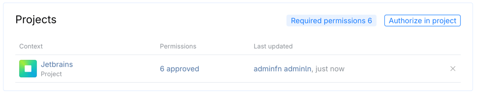
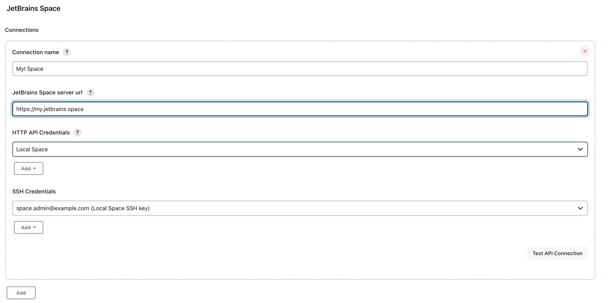
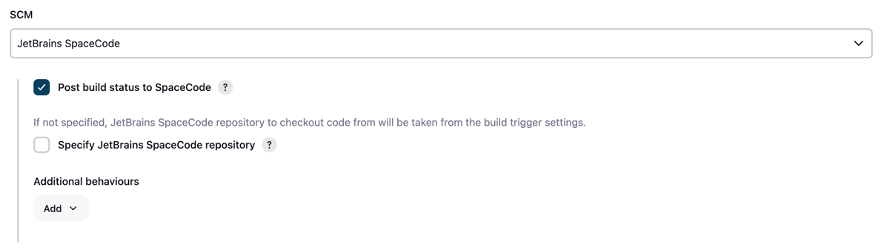
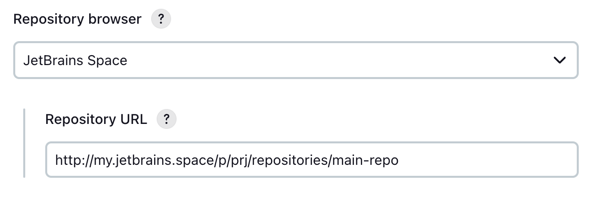

# JetBrains Space plugin for Jenkins (WIP)

[](https://confluence.jetbrains.com/display/ALL/JetBrains+on+GitHub)

> **Work in progress** - the integration between JetBrains Space and Jenkins is currently being developed and will soon be ready to use

## About

This Jenkins plugin provides an integration with JetBrains Space and enables the following use cases:
* Triggering jobs in Jenkins on new commits or merge request updates in JetBrains Space;
* Reporting build status to JetBrains Space (can be used in [Quality Gates for Merge Requests](https://www.jetbrains.com/help/space/branch-and-merge-restrictions.html#quality-gates-for-merge-requests));
* Using Jenkins jobs for [safe merging](https://www.jetbrains.com/help/space/branch-and-merge-restrictions.html#safe-merge) changes to the main branch in JetBrains Space;
* Posting messages to the merge request timeline in JetBrains Space on behalf of Jenkins integration;
* Hyperlinks to branches, files and diffs in JetBrains Space on the Changes page of a Jenkins build.

Please use GitHub Issues to report problems or suggest enhancements.

## Requirements

* Jenkins version 2.401.3+
* Current JetBrains Space in cloud or Space On-Premises 2024.1+   

## License

Licensed under MIT, see [LICENSE](LICENSE.md)

## Table of Contents
- [Configuration](#configuration)
  - [Enable Jenkins integration in Space](#enable-jenkins-integration-in-space)
  - [Configure Space integration in Jenkins](#configure-space-integration-in-jenkins)
- [Usage](#usage)
  - [Triggering Builds](#triggering-builds)
  - [Using Jenkins builds for safe merge](#using-jenkins-builds-for-safe-merge)
  - [Checking out source code from Space](#checking-out-source-code-from-space)
  - [Hyperlinks to Space for build changes](#hyperlinks-to-space-for-build-changes)
  - [Posting build status to Space](#posting-build-status-to-space)
  - [Posting a message to the merge request timeline in Space](#posting-a-message-to-the-merge-request-timeline-in-space)
  - [Calling Space HTTP API from pipeline script](#calling-space-http-api-from-pipeline-script)
  - [Environment variables](#environment-variables)
- [Contributing](#contributing)

## Configuration

There are two main steps to configuring this integration. The initial setup is done in Space and the final configuration is completed in Jenkins. 

### Enable Jenkins integration in Space

Jenkins integration can be enabled on the **Featured Integrations** page of the **Administration** section in JetBrains Space.
Navigate to this page and click the **Enable** button for Jenkins integration. In the opened dialog, enter Jenkins URL 
and choose Space projects containing git repositories that you want to build with Jenkins. After pressing the **Save** button,
you will be presented with the Jenkins integration settings page. You can also open this page any time by pressing the **Manage** button
for Jenkins integration on the **Featured Integrations** page.

The Jenkins integration management page allows you to later modify both Jenkins URL and the list of Space projects.
For each of the projects you can also customize permissions granted to Jenkins integration in Space. You might need this page
to invoke Space API methods from your Jenkins pipeline scripts as described in [Calling Space HTTP API from pipeline script](#calling-space-http-api-from-pipeline-script).
You can also revoke all the permissions and disable Jenkins integration for a given project by clicking the cross button next to this project. 
Enabling Jenkins integration for a new project is done via the **Authorize in project** button.
If you don’t have the administrator rights in those projects, you’ll also have to wait for the project administrator to approve a permission request for the Jenkins integration.


Below the projects section of this page, there are two sections for authenticating Jenkins requests to Space.
The first one contains **Client ID** and **Client secret** values used to authenticate requests to Space HTTP API from Jenkins.
You'll need to provide them when setting up the integration on the Jenkins side.
The second credentials section allows you to manage git SSH keys associated with the Jenkins integration. Jenkins uses those keys to check out source code
from git repositories hosted by JetBrains Space. You need to upload a public SSH key to Space on this page and then provide the corresponding private key to Jenkins
when setting up the integration on the Jenkins side.

There might be a case when you can't install this plugin to Jenkins, but still want to integrate Jenkins with JetBrains Space.
This is possible, although the configuration and usage process for such setup is less straightforward. In this case, make sure to uncheck
the **JetBrains Space plugin installed in Jenkins** checkbox on Jenkins integration management page in JetBrains Space.
See [this document](docs/integration-without-plugin.md) for more details.

### Configure Space integration in Jenkins

Install this plugin to your Jenkins instance. This is done via the **Jenkins > Manage Jenkins > Manage Plugins** menu in Jenkins.

**Note that even though using the plugin is highly recommended, as it significantly simplifies integration, it is still possible to integrate Jenkins with Space without installing the plugin.
See [this document](docs/integration-without-plugin.md) for more details.**

Make sure that you have the Jenkins URL configured in Jenkins itself - navigate to **Jenkins > Manage Jenkins > System**, then find and fill in the **Jenkins URL** field. 

For establishing a connection with JetBrains Space, we will need to add the Space API credentials and SSH key to Jenkins. 
Go to **Jenkins > Manage Jenkins > Credentials** page, pick a domain to add credentials to (choose **System > Global credentials (unrestricted)** if in doubt) and add two credentials instances there.
Pick the **JetBrains Space API credentials** kind for the first instance and provide the client id and secret values obtained from Space.
Also provide a meaningful description that identifies your Space instance, especially if you are going to add more than one Space instance to your Jenkins installation.

The second credentials instance should be of the **SSH Username with private key** kind. Provide the private SSH key corresponding to the public key you've uploaded to JetBrains Space.
The **Username** should match the application name you've entered in JetBrains Space.

After creating credentials in Jenkins, we're ready to add the connection to Space itself. Go to the **Jenkins > Manage Jenkins > System** page and find the **JetBrains Space** section.
Add a new connection, specify a meaningful name for it (especially if there will be more than one), enter the URL of your Space organization and select the API and SSH credentials from the dropdown lists.
Test your connection to Space by clicking the **Test API connection** button. If the connection fails, check that the URL and client id / secret credentials you've specified are correct.
Note: SSH connection to Space git repositories is not tested by this button.



## Usage

### Triggering builds

Space plugin provides an option to trigger builds whenever new commits are pushed to a git repository or some changes are made to a merge request in Space.
This trigger is enabled by the **Triggered by JetBrains Space** checkbox in the **Build Triggers** section of the job or pipeline configuration page.
For this trigger, you need to specify the Space connection, project and git repository to use. The list of projects and repositories in the drop-down menus is fetched from the Space API, 
filtered to only include projects authorized for integration with Jenkins during the Space-side setup process.

If you opt to trigger a build by new commits pushed to the repository, you can also specify which branches should trigger a build and which ones should not.
The text field **Branches** under the **Trigger on commits** option accepts a list of branch specs separated by a semicolon.
Each branch spec can contain a branch name or  `*` wildcard and should start with either `+` (include branches)  or `-` (exclude branches) symbol, excludes take precedence over includes.

If a build is set to be triggered by merge request changes, there are three event filters available:
* When the **Build only after merge request is approved by all reviewers** checkbox is checked, builds will only be triggered for merge requests approved by all the invited reviewers.
  There should be at least one reviewer in a merge request to trigger a build.
  A build will be triggered when new commits are added to a merge request (provided that all reviewers' approvals are finalized and not reset by these commits) 
  or when the last reviewer approves the merge request;
* **Branch specs** filter has the same format as the one for triggering by commits, and is applied to the source branch of a merge request;
* **Title filter regex** allows triggering builds only for merge requests with a title matching specified regular expression.
  A build will be triggered when merge request with title matching regex is created, when new commits are added to it, or when non-matching merge request title is changed so that it now matches the regex.
  Regular expression must match the entire merge request title, not just a part of it. For example, to exclude all merge requests with title starting with "WIP" from triggering builds, specify `(?!WIP).+` as a regex.

You might occasionally want to trigger a Jenkins build by specifying a branch name or merge request number manually, instead of relying on the trigger.
This is possible:
* Make your Jenkins project parameterized (go to **Configuration** page and check the **This project is parameterised** checkbox);
* Add the **GIT_BRANCH** (if your Jenkins job is set up for triggering on branch updates) or **SPACE_MERGE_REQUEST_NUMBER** (if it is used for safe merges or triggered on merge request updates) string parameter;
* Run the build manually specify either the git branch name or Space merge request number.

The build will run as if it has been triggered by the change in the corresponding branch or merge request.

### Using Jenkins builds for safe merge

Safe merge is a JetBrains Space feature that lets you execute quality checks for the merge request on the merge commit before changes are actually merged into target branch.
It checks a temporary merge commit it creates and allows you to merge only if the checks are successful.
See [Space documentation](https://www.jetbrains.com/help/space/branch-and-merge-restrictions.html#safe-merge) on safe merge for more information.

You can use builds in Jenkins to perform quality checks for safe merge. On Jenkins side, you need to enable **Triggered by JetBrains Space** for a build,
specify Space connection, project and repository and enable safe merge. Safe merge can be enabled in the trigger settings in one of the three ways:
* if the build will be used only for safe merges, choose **Use only for safe merge**;
  * if the build will be used for safe merges as well as automatically triggered by pushes to specific git branches, choose **Trigger on commits** and then check **Also allow safe merge**;
  * if the build will be used for safe merges as well as automatically triggered by changes to specific merge requests, choose **Trigger on merge requests changes** and then check **Also allow safe merge**.

On Space side, safe merge should be configured in `safe-merge.json` file that is stored in the git repository. Here is a sample of safe merge configuration for Jenkins:
```json
{
    "version": "1.0",
    "builds": [
        {
            "jenkins": {
                // name of the Jenkins connection configured in Space 
                "connection-name": "Jenkins",
                // full name of the Jenkins job or workflow, including all the parent folders if any
                "project": "Folder/NestedJob"
            }
        }
    ]
}
```

In the Jenkins pipeline script, the only thing you'll need to have is `checkout SpaceGit()` step to check out source code from git.
The temporary branch with the merge commit created by Space will be checked out from the repository specified in build trigger settings.
Build status will also be automatically reported to Space upon build completion.

### Checking out source code from Space

The recommended way to check out sources to build from a git repository hosted in JetBrains Space is by using the SCM (Source Control Management) source provided by the plugin.

For Jenkins jobs, it is available under the **JetBrains Space** radio button in the **Source Code Management** section of the job configuration page.
There are two options for checking out code from Space by using this SCM:
* **Post build status to Space** checkbox determines whether a build status will be automatically reported to Space
  to be displayed as an external check for the commit (which can be further used for the [Merge request quality gates](https://www.jetbrains.com/help/space/branch-and-merge-restrictions.html#quality-gates-for-merge-requests) or [Safe merge](https://www.jetbrains.com/help/space/branch-and-merge-restrictions.html#safe-merge) functionality in Space).
  When this checkbox is selected, Jenkins will report the status for the git commit currently being built to Space twice - first as `running` when the build starts and then as `succeeded`, `failed` or `terminated` depending on the build outcome when it finishes.
* **Specify Space repository** optional section allows overriding Space connection, project and repository that build status is reported to.
  By default, these parameters are taken from the build trigger settings. If the build isn't triggered by the JetBrains Space trigger, then they must be specified in the source checkout settings, 
  otherwise the build will fail at runtime.



For Jenkins pipelines, you can invoke it with the standard `checkout` pipeline step by passing a parameterized instance of `SpaceGit` object to it:
```groovy
checkout SpaceGit()
checkout SpaceGit(postBuildStatusToSpace: false)
checkout SpaceGit(projectKey: 'PRJ', branches: [[name: 'refs/heads/feature-*']], repository: 'prj-main-repo', spaceConnection: 'Space')
```

All the parameters in the scripted form described above are optional. However, the parameters *spaceConnection*, *projectKey* and *repository* are bundled and should be either all present or all omitted.
You can use the Jenkins pipeline syntax generator to pick the **checkout** step, choose the **JetBrains Space** source, configure all the parameters in the UI
and then generate a script for calling this step with the parameters configured.

There is also an option to check out sources from Space git repository by using a standard Git SCM and providing the git repo clone URL and SSH key or HTTP password in place.
```groovy
checkout scmGit(branches: [[name: '*/master']], extensions: [], userRemoteConfigs: [[credentialsId: 'ssh-creds-for-space', url: 'ssh://git@git.jetbrains.space/my/proj/proj-repo.git']])
```

It works, but you have to copy the repository URL from the **Start coding** dialog in Space manually instead of just picking the Space connection,
project, and repository from the dropdown lists. You will also lose some of the Space-specific environment variables in this case.

### Hyperlinks to Space for build changes

When a job or pipeline checks out source code from Space a git repository using Space SCM as described in the section above,
the plugin will enrich the commits and changes info on the **Changes** page of a job or pipeline by adding links to JetBrains Space for commits, files and file diffs.
This allows you to easily navigate to Space UI to view the commits being build, files that they modify and change diffs for these files.

If you are checking out source code by using standard Git SCM instead of Space SCM, you can also enable links to Space for the **Changes** page of your builds.
Choose the **JetBrains Space** option for the **Repository browser** field of the Git SCM and specify base repository URL in the form of `https://<your Space instance>/p/<project key>/repositories/<repository name>`



The scripted form for such pipeline checkout step will have the `browser` parameter with `jbSpace` specified as its value:

```groovy
checkout scmGit(browser: jbSpace('http://my.jetbrains.space/p/prj/repositories/main-repo'), /* branches, userRemoteConfigs etc... */)
```

### Posting build status to Space

A job or pipeline in Jenkins will automatically post build status for the commit to Space if source code has been checked out with the [Space SCM](#checking-out-source-code-from-space) source.
Build will be reported as running upon source code checkout, and completed, failed or terminated, depending on the build outcome upon its completion.
Automatic build status posting is enough for most cases, but the plugin also defines a pipeline step for more granular control
over when and what status is posted to Space - the **postBuildStatusToSpace** pipeline step:

```groovy
postBuildStatusToSpace buildStatus: 'SUCCEEDED'
```

As usual, you can explore the parameters available and generate the script snippet on the **Pipeline syntax** page in Jenkins.
The only required parameter is **Build status to report** (or *buildStatus* in the script representation).
There are also two optional sections that allow overriding the Space connection parameters (Space instance, project and repository) and the git commit and branch name that the build status is reported for.
When the Space connection parameters aren't specified explicitly, they are taken either (in priority order) from the build trigger settings (if JetBrains Space trigger is enabled for this job or pipeline)
or from the source code checkout settings (this can be either Space SCM or Git SCM, in the latter case Jenkins will try to infer the configured Space connection based on the git clone repository URL).

Once a build status is reported to Space by invoking the **postBuildStatusToSpace** pipeline step, it won't be automatically reported again
when the build finishes, to prevent overwriting the status reported by the step. Thus, you can use a number of **postBuildStatusToSpace** in your pipeline script
to report build failures for some cases and at the same time rely on the automatic build status posting to report the final outcome
when none of those cases have happened and thus no post build status steps have been called. 

### Posting a message to the merge request timeline in Space

Another pipeline step provided by the plugin allows posting a message to the merge request timeline in Space on behalf of Jenkins integration.

```groovy
postReviewTimelineMessageToSpace 'Here are some details about how the build is going...'
```

You can use [markdown syntax](https://www.jetbrains.com/help/space/markdown-syntax.html) to add formatting to the message.
If your job or pipeline uses JetBrains Space trigger listening to merge request updates, then the message text is the only parameter required for the pipeline step.
Otherwise, you will also need to provide the **mergeRequestNumber** parameter. The number of a merge request is part of its URL - `/p/<project key>/reviews/<number>/timeline`.

There is also an option to override Space connection and project for the unlikely case when the JetBrains Space trigger or the git checkout step settings of the job or pipeline cannot be used.

### Calling Space HTTP API from pipeline script

Space provides an extensive HTTP API to fetch or manipulate its data, described in detail at https://www.jetbrains.com/help/space/api.html.
Space plugin for Jenkins provides a pipeline step to easily perform calls to this API on behalf of Jenkins integration.
You pick one of the preconfigured Space connections, specify HTTP method, path and request body, and the step takes care of proper authentication
and deserialization of a JSON response. The step returns parsed JSON response in the form of [JsonNode](https://fasterxml.github.io/jackson-databind/javadoc/2.8/com/fasterxml/jackson/databind/JsonNode.html) instance from the Jackson library.
You can then access various properties of the resulting JSON by using indexing into its properties.

```groovy
script {
    def result = callSpaceApi(httpMethod: 'GET', requestUrl: '/api/http/applications/me')
    echo result["name"].asText()
    echo result["createdAt"]["iso"].asText()
}
```

By default, the Space instance to perform HTTP request to is taken from the JetBrains Space trigger or git checkout step settings of the job or pipeline.
There is also an option to override this choice.

**NOTE:** Make sure you grant Jenkins integration the permissions required to access all the API endpoints you intend to call from your pipeline scripts. 

### Environment variables

Space plugin provides a number of environment variables that can be used by the pipeline logic:
* `SPACE_URL` - base URL of your Space organization;
* `SPACE_PROJECT_KEY` - Space project key;
* `SPACE_REPOSITORY_NAME` - git repository name

These three env variables are provided by the JetBrains Space trigger or by the source code checkout step (code checkout settings take precedence over build trigger in case both have explicitly specified Space connection).

When a build is triggered by a Space merge request, those variables are also provided:
* `SPACE_MERGE_REQUEST_ID` - merge request identifier, can be used to query more details about the merge request from the Space HTTP API; 
* `SPACE_MERGE_REQUEST_NUMBER` - merge request number;
* `SPACE_MERGE_REQUEST_SOURCE_BRANCH` - name of the merge request source branch;
* `SPACE_MERGE_REQUEST_TARGET_BRANCH` - name of the merge request target branch;
* `SPACE_MERGE_REQUEST_TITLE`- merge request title;
* `SPACE_MERGE_REQUEST_URL` - URL of the merge request page in Space; 
* `IS_SAFE_MERGE`- true if build has been triggered by a safe merge, absent otherwise;
* `IS_DRY_RUN` - true if safe merge is being executed in dry run mode (that is, Space won't merge the changes into target branch even if checks are successful);
* `SAFE_MERGE_STARTED_BY_USER_ID` - id of Space user that has started the safe merge; absent if build is not triggered by safe merge.

All the environment variables provided by the standard Git plugin (https://plugins.jenkins.io/git/#plugin-content-environment-variables) are also available when checking out source code using Space SCM.

## Contributing

Refer to our [contribution guidelines](CONTRIBUTING.md)

