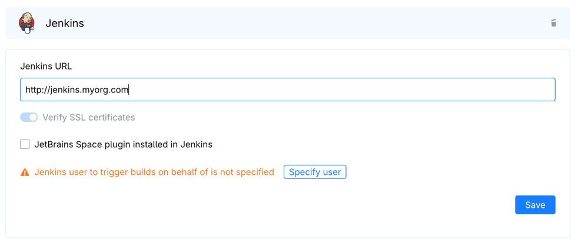

### Preparing the integration

Configuring the integration on the Space side is almost the same as with the Jenkins plugin installed.
Please refer to the [corresponding instructions](../README.md#enable-jenkins-integration-in-space) for completing this step.
There are just a couple of differences to this process.

First, you will need to uncheck the **JetBrains Space plugin installed in Jenkins** checkbox when setting up Jenkins integration in JetBrains Space.
Next, you will be asked to provide the Jenkins username and API token which Space needs to trigger builds in Jenkins. 
Jenkins will presume all builds triggered by the integration as triggered on behalf of this user. 
To generate this token in Jenkins, go to your personal profile settings, find the **API tokens** section and create a new token. 
Then return to the Jenkins integration management page in JetBrains Space, 
click the **Specify user** button and provide your Jenkins username and the API token that you've just created.

In order to report build statuses, Jenkins pipelines need to authenticate requests to JetBrains Space. 
The authentication is handled differently without Jenkins plugin installed, 
which is why it is more convenient to use a permanent token rather than a client id and secret pair.
After you disabled the **JetBrains Space plugin installed in Jenkins** checkbox, 
the **Space API Credentials** will allow you to manage permanent tokens instead of providing the client id and secret pair. 
Create a new permanent token here and copy it - you will need to save it to Jenkins next.


To add the permanent token credential to Jenkins, navigate to **Manage Jenkins > Credentials**, 
pick a domain to add the credentials to (choose **System > Global credentials (unrestricted)** if in doubt) and add a new credential there.
Choose the type **Secret text** and paste the permanent token generated on the Space side into the **Secret** field.

### Safe merge setup example

Setting up safe merge for Space git repository is the same regardless of whether the plugin is installed in Jenkins or not.
To configure safe merge in JetBrains Space, refer to [corresponding section](../README.md#using-jenkins-builds-for-safe-merge)

On the Jenkins side however, the process is much more complicated than with the plugin installed. Do the following to prepare your Jenkins pipeline to be used for safe merge:
* Add the **GIT_BRANCH** parameter of type `string` to your pipeline. They will be passed from Space when triggering a build in Jenkins.
* Set up posting external commit check results as part of your Jenkins pipeline. Take the following code snippet as an example:

```groovy
def postBuildResultToSpace(result) {
    env.REQUEST_BODY = "{ \"branch\": \"$GIT_BRANCH\", \"executionStatus\": \"$result\", \"url\": \"$BUILD_URL\", \"externalServiceName\": \"Jenkins\", \"taskName\": \"$JOB_NAME\", \"taskId\": \"$JOB_NAME\", \"taskBuildId\": \"build-$BUILD_ID\" }"
    sh 'curl -s $SPACE_URL/api/http/projects/key:$SPACE_PROJECT/repositories/$SPACE_REPO/revisions/$GIT_COMMIT/external-checks -d \"$REQUEST_BODY\" -H \"Authorization: Bearer $SPACE_TOKEN\" -H \"Accept: application/json\" -H \"Content-Type: application/json\"'
}

pipeline {
    agent any

    // Specify Space url, project, repo and api token as environment variables for using in pipeline steps
    environment {
        SPACE_URL = "https://myorg.jetbrains.space"
        SPACE_PROJECT = "PRJ"
        SPACE_REPO = "repo"
        SPACE_TOKEN = credentials('jetbrains.space.token')
    }

    stages {
        // Before performing any build actions, report to Space that build has started.
        // When Space enqueues build for execution, it only gets a link to created queue item as a result.
        // Notifying that build has started enables Space to match this queue item with a started build instance.
        // This is an optional, but recommended step.
        stage('Report build started') {
            steps {
                // Source code must be checked out from git before any build status can be reported
                // so that we can propagate commit id to the environment variable to be used for reporting build status.
                // Note also how the GIT_BRANCH env variable is used to specify refspec to fetch as well as branch name to check out from git.
                script {
                    def scmVars = checkout scmGit(branches: [[name: env.GIT_BRANCH]], extensions: [], userRemoteConfigs: [[credentialsId: 'ssh-creds-for-space', refspec: "+${env.GIT_BRANCH}:${env.GIT_BRANCH}", url: "ssh://git@git.jetbrains.space/myorg/${env.SPACE_PROJECT}/${env.SPACE_REPO}.git"]])
                    env.GIT_COMMIT = scmVars.GIT_COMMIT
                }
                postBuildResultToSpace("RUNNING")
            }
        }

        // Do your build
        stage('Do build') {
            steps {
                sh 'sleep 10'
            }
        }
    }

    // Handle all the possible outcomes of the pipeline execution
    // and report them to Space
    post {
        success {
            script {
                postBuildResultToSpace("SUCCEEDED")
            }
        }
        failure {
            script {
                postBuildResultToSpace("FAILED")
            }
        }
        unstable {
            script {
                postBuildResultToSpace("FAILED")
            }
        }
        aborted {
            script {
                postBuildResultToSpace("TERMINATED")
            }
        }
    }
}
```

The function `postBuildResultToSpace` is responsible for posting the build execution status to Space. It uses a number of environment variables for building the request:

- GIT_BRANCH here is the parameter passed to Jenkins from Space when starting the build;
- GIT_COMMIT env variable is filled from the results of the source code checkout step;
- BUILD_URL, JOB_NAME and BUILD_ID are built-in env variables provided by Jenkins;
- SPACE_URL, SPACE_PROJECT and SPACE_REPO are env variables containing your Space organization URL, Space project key, and Space repository name. In this example they are specified within the pipeline script itself, but they could also be specified elsewhere in Jenkins;
- SPACE_TOKEN is the env variable containing Space API token from credentials.

The function first builds JSON for the request body using Groovy string interpolation (note double quotes) and stores this JSON into the environment variable to be used in the shell script. Then it executes the shell script with the env variables being substituted by the shell itself (note single quotes). String interpolation and quotes escaping is tricky here, but for security reasons it is important that Groovy string interpolation is not used to generate the shell command containing the secret (Space token).
